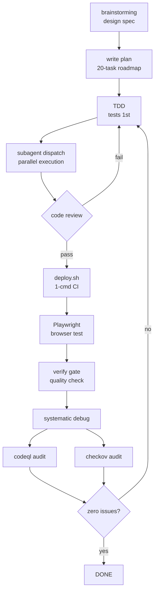

# Portfolio Website

Single-page neo-brutalist portfolio website. Fully automated deployment — one
command builds, provisions infrastructure, uploads, and configures DNS.
84 tests across 4 suites. 14 AWS resources + Upstash Redis managed via CloudFormation.
SEO-optimized with OG/Twitter Cards, JSON-LD structured data for AI
visibility (AEO/GEO), and social sharing previews.
 Built through structured AI-driven development — [design spec](docs/superpowers/specs/2025-07-09-resume-website-design.md) → [implementation plan](docs/superpowers/plans/2025-07-09-resume-website.md) → TDD → parallel subagent execution → verification gates — using **OpenCode** with the **Superpowers** skill system (see [Skills & Tools Used](#skills--tools-used)).

---

## Architecture


*Generated with [AWS Diagram-as-Code](https://github.com/awslabs/diagram-as-code)*.

The diagram shows the visitor's Browser (external, left) with three
outgoing connections: DNS lookup via **Route53**, HTTPS request to
**CloudFront** (TLS via ACM, 5 security headers via ResponseHeadersPolicy)
which reads from **S3** using Origin Access Control, and POST to
**API Gateway → Lambda** → **SES** (for contact form submissions,
with the hCaptcha challenge token obtained separately from the
**hCaptcha** node). Lambda also calls **Upstash Redis** over HTTPS
REST for rate limiting (5 requests / 5 min / IP, fail open on error).
Email authentication records (SPF / DKIM / DMARC / MAIL FROM / ALIAS A)
are rolled up into Route53.

### Infrastructure as Code

All 14 AWS resources are provisioned declaratively via a single CloudFormation
template ([`infrastructure/template.yaml`](infrastructure/template.yaml)):

| Category | Resources | Details |
|---|---|---|
| **DNS** | Route53 | ALIAS A records (root + www), SES verification, SPF, DKIM, DMARC |
| **CDN + Storage** | CloudFront, S3, ACM, CachePolicy, OriginRequestPolicy, ResponseHeadersPolicy, OAC | HTTPS/HTTP3, TLS via ACM (us-east-1), security headers |
| **Compute** | Lambda, IAM Role | Python 3.12, 5 concurrency, `ses:SendEmail` only, runtime 12s |
| **API** | API Gateway HTTP API | 1 gateway, 1 integration, `POST /` route, `$default` stage |
| **Rate Limiting** | Upstash Redis | Serverless over HTTPS REST, `INCR` + `EXPIRE`, 1s timeout, fail open |
| **Parameters** | 8 CF params | Domain, Cert, hCaptcha (secret + site key), emails, Upstash (URL + token) |

### Defense-in-depth

| Layer | Mechanism |
|---|---|
| **Bot protection** | hCaptcha (invisible, server-side verification) |
| **Origin restriction** | Lambda rejects requests from unknown domains using `urlparse` exact matching (403) |
| **Rate limiting** | 5 requests/5 min/IP via Upstash Redis REST API — fail open on Redis error (429) |
| **Error codes** | `CF_RATE_LIMITED` / `CF_FORBIDDEN` / `CF_CAPTCHA_FAILED` / `CF_DELIVERY_FAILED` / `CF_VALIDATION` surfaced to frontend for user-friendly messaging, logged for debugging |
| **Rate limit auth** | Bearer token in `Authorization` header, URL + token stored as NoEcho CF params and persisted in `.env` |
| **CORS** | Restricted to domain (not `*`) |
| **CSP** | Content-Security-Policy: script-src, connect-src, frame-src restricted to hCaptcha, API Gateway, Google Analytics |
| **Concurrency** | Lambda reserved concurrency: 5 |
| **SPF** | `v=spf1 include:_spf.google.com include:amazonses.com ~all` |
| **DKIM** | 3 signing keys via Amazon SES |
| **DMARC** | `p=none` — monitoring mode (reports to admin email) |
| **AEO/GEO** | JSON-LD Person schema with `sameAs` (LinkedIn+GitHub), `alumniOf`, `worksFor`, `knowsAbout`, `hasCredential`, `knowsLanguage` for entity disambiguation |

---

## Tech Stack

| Layer | Technology |
|---|---|
| **Frontend** | React 18, Vite 6, Tailwind CSS 3, Lucide React |
| **Backend** | Python 3.12, AWS Lambda, API Gateway HTTP API |
| **Email** | AWS SES (SPF + DKIM + DMARC) |
| **Rate Limiting** | Upstash Redis (serverless, REST API, free tier), bearer token auth |
| **Hosting** | S3 + CloudFront (HTTPS, HTTP/3, HTTP/2, compression) |
| **DNS** | Route53 (ALIAS A, SPF TXT, DKIM CNAMEs, DMARC TXT, SES verification TXT, MAIL FROM MX) |
| **IaC** | CloudFormation (14 resources, 8 parameters) |
| **Testing** | Vitest + testing-library (15), pytest (33), bash mocks (19 deploy + 17 template) |
| **Design** | Neo-brutalism (ui-ux-pro-max design system) |
| **Analytics** | Google Analytics 4 (GTM gtag.js, injected via `VITE_GTM_ID` at build time) |
| **SEO & Social** | OG Cards, Twitter Cards, JSON-LD Person schema, robots.txt, canonical URL |
| **CI/CD** | `deploy.sh` — 1 command: build → deploy → invalidate |

---

## Development Lifecycle



**Code review is a gate**: fail → loop back to TDD. Pass → continue to deploy.
Multi-agent consortium audits (MoA) validate design specs before implementation
(SEO → Security → Social → AEO/GEO agents). Each phase maps to a Superpowers or
community skill:
**brainstorming** (design) → **writing-plans** (breakdown) → **TDD** (tests first) →
**subagent-driven-development** (parallel execution) → **requesting/receiving-code-review** →
**deploy.sh** (CI/CD) → **Playwright MCP** (browser testing) →
**systematic-debugging** (diagnose failures) → **verification-before-completion** (quality gate) →
**codeql-security-scan** (audit findings) + **checkov-iac-scan** (IaC audit) → loop until zero issues.

---

## Methodology

Built with **OpenCode** (AI coding agent) using the **Superpowers** skill system.

### Production Engineering

Moving beyond simple scripting to automated multi-step deployment with
mock-testable components and infrastructure-as-code:

- **CloudFormation** provisions 14 AWS resources in a single `deploy` command
- **`deploy.sh`** handles SES domain setup, certificate auto-detection,
  Route53 DNS, frontend build, S3 upload, and CloudFront invalidation
- **Idempotent operations** — skips already-configured resources (SES domain,
  Route53 records, cert)
- **36 shell unit tests** using mocked AWS CLI verify every code path

### Agent Architecture

Every interaction with OpenCode follows a **reAct (Reasoning + Acting)** loop: observe (read files, run commands) → reason (analyze, decide next step) → act (edit code, run checks). This cycle repeats continuously — every bug fix, test run, and deploy is a reAct turn.

For larger work, **hierarchical delegation** layers on top: the main agent decomposes a plan into independent tasks and dispatches **sub-agents**, each running their own reAct loop in parallel with their own context and tools. Sub-agents report back; the main agent integrates results, runs verification, and advances the plan. The 20-task implementation was executed this way via `subagent-driven-development`.

### Service Topology

Designed secure connections between AWS services:

- Route53 → CloudFront: ALIAS A records with ACM certificate (us-east-1)
- CloudFront → S3: Origin Access Control (OAC) with bucket policy
- API Gateway → Lambda: AWS_PROXY integration, payload format 2.0
- Lambda → SES: custom domain sender with full SPF/DKIM/DMARC alignment
- Lambda → Upstash Redis: REST API over HTTPS, `INCR` + `EXPIRE` rate keys, 1s call timeout, bearer token auth
- SES domain verification, MAIL FROM MX, DKIM CNAMEs — all automated in deploy script

### Architectural Governance

Structured how the AI agent authenticates to and provisions customer cloud infrastructure:

- **AWS CLI as the control plane**: All infrastructure operations executed through authenticated AWS CLI commands via OpenCode's shell tool — no intermediate UI, direct API access.
- **OAuth-based authentication**: IAM user credentials or console sign-in managed through `aws configure` / `aws login`. A pre-flight auth check (`check_aws_auth`) verifies the session before any user prompts.
- **CloudFormation as the deployment contract**: Infrastructure defined declaratively in templates; the agent invokes `update-stack` or `create-stack` with explicit lifecycle management rather than orchestrating individual create/update calls.
- **`deploy.sh` as the automation boundary**: All multi-step workflows (SES setup, cert detection, DNS config) encapsulated in a versioned, mock-testable shell script — the agent invokes the script rather than composing raw CLI calls.

### Product Feedback Loop

Identified technical friction points during development and built automated guardrails into `deploy.sh`, closing the loop in-project rather than filing external feature requests:

| Friction | Resolution |
|---|---|
| `AWS::Lambda::Url` blocked by org policy | Switched to API Gateway HTTP API |
| DMARC rejection when sending from external domain via SES | Custom SES domain sender with SPF/DKIM alignment |
| SES sandbox: emails silently fail if sender not verified | Automated `verify-email-identity` + polling loop in deploy script |
| JMESPath bracket notation fails on `@` character | Switched to escaped dot notation |
| CloudFront managed policy IDs differ by region | Replaced with inline `AWS::CloudFront::CachePolicy` resources |
| NoEcho params can't be read from CloudFormation API | `.env` persistence pattern for secrets (Upstash URL/token, GTM ID) — sourced at script start, prompted once |

---

## Skills & Tools Used

| OpenCode Feature | Skill / Tool | Origin | How Used |
|---|---|---|---|
| **Plan mode** | `brainstorming` | Superpowers | Design spec → clarifying Q&A → design approval |
| **Plan mode** | `writing-plans` | Superpowers | 20-task implementation roadmap with file paths + code |
| **Subagent dispatch** | `subagent-driven-development` | Superpowers | 20 tasks executed in parallel with per-task code reviews |
| **Memory** | `opencode-mem` | OpenCode | Store/query project context, decisions, and preferences across sessions |
| **Skill invocation** | `ui-ux-pro-max` | Community | Neo-brutalist design system (styles, palettes, fonts, spacing) |
| **Skill invocation** | `ponytail` | Community | Over-engineering audits: cut dead code, removed unused dependencies |
| **Skill invocation** | `test-driven-development` | Superpowers | RED-GREEN-REFACTOR cycle: tests written before implementation |
| **Skill invocation** | [`codeql-security-scan`](https://github.com/epratama/codeql-security-scan) | Community | Multi-language static analysis — 157 queries, 0 automated findings, 3 manual fixes ([report](security-report/codeql/2025-07-09-security-audit.md)) |
| **Skill invocation** | [`checkov-iac-scan`](https://github.com/epratama/checkov-iac-scan) | Community | CloudFormation IaC audit — 22 passed, 0 critical/high, 10 informational ([report](security-report/checkov/summary-report.md)) |
| **Bug diagnosis** | `systematic-debugging` | Superpowers | Debugged Lambda::Url block, DMARC alignment, JMESPath syntax, CF policy IDs, CSP hCaptcha blocking, template indentation crashes |
| **Quality gate** | `verification-before-completion` | Superpowers | Ran all 84 tests + lint before every completion claim |
| **Peer review** | `requesting-code-review` | Superpowers | Cross-checked work at task completion boundaries |
| **Code review response** | `receiving-code-review` | Superpowers | Security audit feedback: dev-bypass gating, CSP hardening, error message sanitization |
| **Consortium audit** | `brainstorming` | Superpowers | 4-agent MoA audit (SEO/Security/Social/AEO) — validated design spec v1.1 before implementation |
| **Social debug** | `systematic-debugging` | Superpowers | Traced transparent PNG root cause — Canvas `fillText()` failed on `about:blank` (no fonts). Fixed with Python Pillow + Helvetica Bold. LinkedIn OG scraper diagnostic via Playwright. |
| **Image generation** | Python Pillow | Community | EP monogram social share image (1200×630, 7KB) — identical visual identity to favicon |
| **Browser testing** | `Playwright MCP` | OpenCode | Automated end-to-end browser testing of contact form, CSP, and social sharing debuggers |
| **Diagram as code** | `awdsac-mcp-server` | AWS | Professional AWS architecture diagram with standard icons ([source](docs/diagrams/aws-architecture.yaml)) |
| **Process artifacts** | `docs/superpowers/specs/` + `docs/superpowers/plans/` | — | Full lifecycle from design spec to implementation plan — see [Development Artifacts](#development-artifacts) |

---

## Test Suites

| Suite | Language | Tests | Command |
|---|---|---|---|
| **Frontend components** | JSX (Vitest) | 15 | `npm -C frontend test` |
| **Lambda backend** | Python (pytest) | 33 | `python3 -m pytest backend/test_lambda.py -q` |
| **Deploy script** | Bash (mocks) | 19 | `./test-deploy.sh` |
| **CF template** | Bash (validation) | 17 | `./test-template.sh` |
| **Total** | | **84** | |

### What the tests cover

| Area | Tests verify |
|---|---|
| **App smoke** | Renders without crash, all 8 section IDs, title, social links, build showcase, CSP directives verified |
| **Contact form** | Field rendering, empty validation, email format, filled form clears errors |
| **Scroll reveal** | Returns `{ref, isVisible}`, `prefers-reduced-motion` → immediate |
| **Experience** | Descending chronological order (current role before internship) |
| **Lambda validation** | Name/email/message required, max lengths, mobile format + CR/LF stripping, email format, JSON decode error |
| **Lambda security** | Origin exact-matching, rate limit (5/5min via Upstash Redis REST, 429), fail-open on Redis error, Upstash env var presence, `CF_` error codes on all responses |
| **Deploy flow** | AWS auth check (authenticated, `aws login`, expired session, CI/CD skip, profile), stack check, SES verify/decline/auto-verify, cert detect (issued/pending/none), cert request, Route53 DNS (skip/update/non-Route53) |
| **CF template** | Syntax validation, key resources present, 8 parameters, secrets marked `NoEcho` |

---

## Development Artifacts

Every feature starts with a design spec, is executed against a TDD-gated plan,
and closes with a security audit. These artifacts show the process, not just
the product.

### Design Specs

| Spec | Scope |
|---|---|
| [`resume-website`](docs/superpowers/specs/2025-07-09-resume-website-design.md) | Architecture decisions, neo-brutalist design tokens, responsive breakpoints, TDD strategy |
| [`seo-social-sharing`](docs/superpowers/specs/2025-07-11-seo-social-sharing-design.md) | OG/Twitter Cards, JSON-LD Person schema, AEO/GEO entity disambiguation (MoA-audited v1.1) |
| [`robots-txt-fix`](docs/superpowers/specs/2026-07-11-robots-txt-fix-design.md) | AI crawler explicit Allow directives, Google-Extended opt-out resolution |
| [`aws-architecture-diagram-v3`](docs/superpowers/specs/2026-07-11-aws-architecture-diagram-v3-design.md) | 11-node overlap-free L→R layout redesign |
| [`rate-limit-redis`](docs/superpowers/specs/2026-07-11-rate-limit-redis-design.md) | Replace in-memory rate_store with Upstash Redis REST API (5/5min, fail open), `CF_` error codes |
| [`aws-sso-auth-check`](docs/superpowers/specs/2026-07-12-aws-sso-auth-check-design.md) | Pre-flight `aws login` check in deploy.sh — browser-based SSO, CI/CD skip, profile support |

### Implementation Plans

| Plan | Scope |
|---|---|
| [`resume-website`](docs/superpowers/plans/2025-07-09-resume-website.md) | Full-stack deployment: S3/CloudFront, Lambda contact form with hCaptcha, API Gateway, Route53 DNS, neo-brutalist CSS, 30 shell unit tests |
| [`seo-social-sharing`](docs/superpowers/plans/2025-07-11-seo-social-sharing.md) | robots.txt, OG image generation, OG/Twitter/SEO meta tags, JSON-LD schema, security rescan, deploy |
| [`rate-limit-redis`](docs/superpowers/plans/2026-07-11-rate-limit-redis.md) | Lambda code, CloudFormation template, deploy.sh prompts, 33 backend tests (TDD) |
| [`aws-sso-auth-check`](docs/superpowers/plans/2026-07-12-aws-sso-auth-check.md) | deploy.sh auth function, 19 deploy tests, mock-based TDD |

### Security Reports

| Report | Scope |
|---|---|
| [`codeql`](security-report/codeql/2025-07-09-security-audit.md) | Multi-language SAST: Python + JavaScript — 157 queries, 0 automated findings, 3 manual fixes verified |
| [`checkov`](security-report/checkov/summary-report.md) | CloudFormation IaC scan — 22 checks passed, 0 critical/high misconfigurations |
| [`codeql-2026`](security-report/codeql/summary-report.md) | Python + JavaScript — 0 critical/high/medium, 2 low false positives |
| [`checkov-2026`](security-report/checkov/summary-report.md) | CloudFormation IaC scan — 22 passed, 10 failed (0 critical/high, all risk-accepted) |

---

## Deploy

Single command deploys everything:

```bash
./deploy.sh <stack-name>
```

### Full Pipeline

| Phase | What happens |
|---|---|
| **Pre-flight** | Checks `aws`, `jq`, `npm` installed. Verifies AWS authentication via `aws login` (console credentials, browser-based SSO). Queries CloudFormation for existing stack config. |
| **Interactive prompts** | Sender/recipient emails (prefilled from stack if exists), hCaptcha secret (hidden input), Upstash Redis URL + token (persisted to `.env`, prompted once), Google Analytics ID (optional, leave empty to skip). |
| **SES email verification** | Checks if sender + recipient are verified in SES. If not: sends verification email, polls every 5s (up to 2.5 min) until confirmed. Declining aborts deploy. |
| **ACM certificate** | Auto-searches for existing ISSUED cert in us-east-1. If found: reuses. If PENDING: shows DNS records and exits. If none: offers to request new, shows validation CNAMEs. |
| **CloudFormation deploy** | Builds parameter overrides, runs `update-stack` (or `create-stack` for new stacks). After deploy: verifies DomainName + CertificateArn were applied, warns if not. |
| **Build + upload** | Runs `vite build` with API Gateway URL + hCaptcha site key + Analytics ID. Syncs `dist/` to S3 with `--delete`. Creates CloudFront invalidation. |
| **Route53 DNS** | If custom domain configured: finds hosted zone, auto-creates ALIAS A records (root + www) pointing to CloudFront. Skips if already correct. |

All operations are idempotent — running twice produces the same result.

### SES Domain Setup

When the sender email uses a custom domain (not gmail.com etc.) and the domain
is on Route53, `deploy.sh` automatically configures email authentication:

| Step | Record | Purpose |
|---|---|---|
| **Domain verification** | `_amazonses.domain.com` TXT | Proves you own the domain to SES |
| **SPF (sender auth)** | `domain.com` TXT (`v=spf1 include:amazonses.com`) | Receiving servers know SES is allowed. Merges with existing Google Workspace SPF if present. Preserves non-SPF TXT records. |
| **DKIM (signing)** | `*._domainkey.domain.com` CNAME × 3 | Cryptographically signs every email — prevents tampering and improves trust score |
| **MAIL FROM (envelope)** | `mail.domain.com` MX + SPF TXT | Custom bounce/return-path domain so SPF aligns with the `From` header |
| **DMARC (policy)** | `_dmarc.domain.com` TXT (`p=none`) | Tells receivers: "if SPF or DKIM fail, still deliver but send me reports." Monitors abuse before upgrading to `p=reject`. |

Without these: emails land in spam (or are rejected). With all five: full
SPF + DKIM + DMARC alignment → inbox delivery.

All operations are idempotent — running `deploy.sh` again skips anything
already configured.

---

## Design

Neo-brutalism — hard borders, chunky shadows, flat colors, bold type.

| Token | Value |
|---|---|
| Background | `#FAFAFA` |
| Text | `#09090B` |
| Primary | `#18181B` |
| Accent | `#2563EB` |
| Border | `3px solid #18181B` |
| Shadow | `4px 4px 0 #18181B` |
| Fonts | Archivo (headings) + Space Grotesk (body) + JetBrains Mono (mono) |
| Favicon | Inline SVG "EP" monogram |

---

## License

MIT
