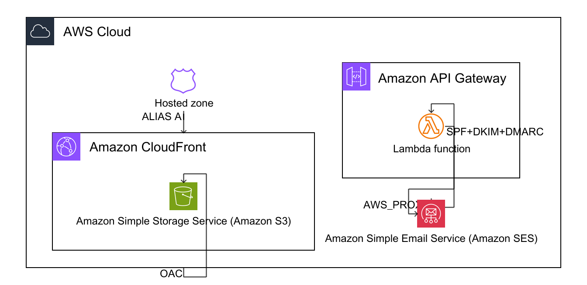

# Portfolio Website

Single-page neo-brutalist portfolio website. Fully automated deployment — one
command builds, provisions infrastructure, uploads, and configures DNS.
74 tests across 4 suites. 14 AWS resources managed via CloudFormation.
 Built through structured AI-driven development — [design spec](docs/superpowers/specs/2025-07-09-resume-website-design.md) → [implementation plan](docs/superpowers/plans/2025-07-09-resume-website.md) → TDD → parallel subagent execution → verification gates — using **OpenCode** with the **Superpowers** skill system (see [Skills & Tools Used](#skills--tools-used)).

---

## Architecture



*Generated with [AWS Diagram-as-Code](https://github.com/awslabs/diagram-as-code)*.

The diagram shows two runtime flows: static content via **CloudFront → S3** with
OAC, and contact forms via **API Gateway → Lambda → SES** with hCaptcha + SPF/DKIM/DMARC.

### Infrastructure as Code

All 14 AWS resources are provisioned declaratively via a single CloudFormation
template ([`infrastructure/template.yaml`](infrastructure/template.yaml)):

| Category | Resources | Details |
|---|---|---|
| **DNS** | Route53 | ALIAS A records (root + www), SES verification, SPF, DKIM, DMARC |
| **CDN + Storage** | CloudFront, S3, CachePolicy, OriginRequestPolicy, ResponseHeadersPolicy, OAC | HTTPS/HTTP3, inline policies, security headers (XFO, HSTS, XCTO, RP) |
| **Compute** | Lambda, IAM Role | Python 3.12, 5 concurrency, `ses:SendEmail` only |
| **API** | API Gateway HTTP API ×4 | AWS_PROXY integration, `POST /` route, `$default` stage |
| **Parameters** | 6 CF params | Domain, Cert, hCaptcha (secret + site key), emails |

### Defense-in-depth

| Layer | Mechanism |
|---|---|
| **Bot protection** | hCaptcha (invisible, server-side verification) |
| **Origin restriction** | Lambda rejects requests from unknown domains using `urlparse` exact matching (403) |
| **Rate limiting** | 3 requests/minute/IP from `requestContext.sourceIp` — sliding window (429) |
| **CORS** | Restricted to domain (not `*`) |
| **CSP** | Content-Security-Policy: script-src, connect-src, frame-src restricted to hCaptcha, API Gateway, Google Analytics |
| **Concurrency** | Lambda reserved concurrency: 5 |
| **SPF** | `v=spf1 include:_spf.google.com include:amazonses.com ~all` |
| **DKIM** | 3 signing keys via Amazon SES |
| **DMARC** | `p=none` — monitoring mode (reports to admin email) |

---

## Methodology

Built with **OpenCode** (AI coding agent) using the **Superpowers** skill system.

### Production Engineering

Moving beyond simple scripting to automated multi-step deployment with
mock-testable components and infrastructure-as-code:

- **CloudFormation** provisions 14 AWS resources in a single `deploy` command
- **`deploy.sh`** handles SES domain setup, certificate auto-detection,
  Route53 DNS, frontend build, S3 upload, and CloudFront invalidation
- **Idempotent operations** — skips already-configured resources (SES domain,
  Route53 records, cert)
- **30 shell unit tests** using mocked AWS CLI verify every code path

### Agent Architecture

Every interaction with OpenCode follows a **reAct (Reasoning + Acting)** loop: observe (read files, run commands) → reason (analyze, decide next step) → act (edit code, run checks). This cycle repeats continuously — every bug fix, test run, and deploy is a reAct turn.

For larger work, **hierarchical delegation** layers on top: the main agent decomposes a plan into independent tasks and dispatches **sub-agents**, each running their own reAct loop in parallel with their own context and tools. Sub-agents report back; the main agent integrates results, runs verification, and advances the plan. The 20-task implementation was executed this way via `subagent-driven-development`.

### Service Topology

Designed secure connections between AWS services:

- Route53 → CloudFront: ALIAS A records with ACM certificate (us-east-1)
- CloudFront → S3: Origin Access Control (OAC) with bucket policy
- API Gateway → Lambda: AWS_PROXY integration, payload format 2.0
- Lambda → SES: custom domain sender with full SPF/DKIM/DMARC alignment
- SES domain verification, MAIL FROM MX, DKIM CNAMEs — all automated in deploy script

### Architectural Governance

Structured how the AI agent authenticates to and provisions customer cloud infrastructure:

- **AWS CLI as the control plane**: All infrastructure operations executed through authenticated AWS CLI commands via OpenCode's shell tool — no intermediate UI, direct API access.
- **OAuth-based authentication**: IAM user credentials or SSO tokens managed through `aws configure` / `aws sso login`. The agent never stores or handles secrets — they live in the host machine's credential chain.
- **CloudFormation as the deployment contract**: Infrastructure defined declaratively in templates; the agent invokes `cloudformation deploy` as a single atomic operation rather than orchestrating individual create/update calls.
- **`deploy.sh` as the automation boundary**: All multi-step workflows (SES setup, cert detection, DNS config) encapsulated in a versioned, mock-testable shell script — the agent invokes the script rather than composing raw CLI calls.

### Product Feedback Loop

Identified technical friction points during development and built automated guardrails into `deploy.sh`, closing the loop in-project rather than filing external feature requests:

| Friction | Resolution |
|---|---|
| `AWS::Lambda::Url` blocked by org policy | Switched to API Gateway HTTP API |
| DMARC rejection when sending from external domain via SES | Custom SES domain sender with SPF/DKIM alignment |
| SES sandbox: emails silently fail if sender not verified | Automated `verify-email-identity` + polling loop in deploy script |
| JMESPath bracket notation fails on `@` character | Switched to escaped dot notation |
| CloudFront managed policy IDs differ by region | Replaced with inline `AWS::CloudFront::CachePolicy` resources |

---

## Development Lifecycle

```
┌──────────┐  ┌──────────┐  ┌──────────┐  ┌──────────┐  ┌──────────┐
│brainstorm│─▶│  write   │─▶│   TDD    │─▶│ subagent │─▶│  code    │
│  spec    │  │  plan    │  │tests 1st │  │ dispatch │  │  review  │
└──────────┘  └──────────┘  └──────────┘  └──────────┘  └────┬─────┘
                                                             │
                                                           (pass)
                                                             │
┌──────────┐  ┌──────────┐  ┌──────────┐  ┌──────────┐       │
│ deploy.sh│─▶│  browser │─▶│  verify  │─▶│systematic│◀──────┘
│ 1-cmd CI │  │  test    │  │  gate    │  │  debug   │
└──────────┘  │(Playwrgt)│  └──────────┘  └────┬─────┘
              └──────────┘                     │
                                               ▼
                                   ┌──────────┐  ┌──────────┐
                                   │ codeql-  │  │ checkov- │
                                   │ security │  │ iac-scan │
                                   │  audit   │  │  audit   │
                                   └────┬─────┘  └────┬─────┘
                                        │             │
                                        └──────┬──────┘
                                               ▼
                     ┌──────────────────────────────────────────────────┐
                     │       LOOP: fix → TDD → review → deploy          │
                     │       repeat until zero issues                   │
                     └──────────────────────────────────────────────────┘
```

**Code review is a gate**: fail → loop back to TDD. Pass → continue to deploy.
Each phase maps to a Superpowers or community skill:
**brainstorming** (design) → **writing-plans** (breakdown) → **TDD** (tests first) →
**subagent-driven-development** (parallel execution) → **requesting/receiving-code-review** →
**deploy.sh** (CI/CD) → **Playwright MCP** (browser testing) →
**systematic-debugging** (diagnose failures) → **verification-before-completion** (quality gate) →
**codeql-security-scan** (audit findings) + **checkov-iac-scan** (IaC audit) → loop until zero issues.

---

## Tech Stack

| Layer | Technology |
|---|---|
| **Frontend** | React 18, Vite 6, Tailwind CSS 3, Lucide React |
| **Backend** | Python 3.12, AWS Lambda, API Gateway HTTP API |
| **Email** | AWS SES (SPF + DKIM + DMARC) |
| **Hosting** | S3 + CloudFront (HTTPS, HTTP/3, HTTP/2, compression) |
| **DNS** | Route53 (ALIAS A, SPF TXT, DKIM CNAMEs, DMARC TXT, SES verification TXT, MAIL FROM MX) |
| **IaC** | CloudFormation (14 resources, 6 parameters) |
| **Testing** | Vitest + testing-library (15), pytest (29), bash mocks (30) |
| **Design** | Neo-brutalism (ui-ux-pro-max design system) |
| **Analytics** | Google Analytics 4 (GTM gtag.js, injected via `VITE_GTM_ID` at build time) |
| **CI/CD** | `deploy.sh` — 1 command: build → deploy → invalidate |

---

## Skills & Tools Used

| OpenCode Feature | Skill / Tool | Origin | How Used |
|---|---|---|---|
| **Plan mode** | `brainstorming` | Superpowers | Design spec → clarifying Q&A → design approval |
| **Plan mode** | `writing-plans` | Superpowers | 20-task implementation roadmap with file paths + code |
| **Subagent dispatch** | `subagent-driven-development` | Superpowers | 20 tasks executed in parallel with per-task code reviews |
| **Memory** | `opencode-mem` | OpenCode | Store/query project context, decisions, and preferences across sessions |
| **Skill invocation** | `ui-ux-pro-max` | Community | Neo-brutalist design system (styles, palettes, fonts, spacing) |
| **Skill invocation** | `ponytail` | Community | Over-engineering audits: cut dead code, removed unused dependencies |
| **Skill invocation** | `test-driven-development` | Superpowers | RED-GREEN-REFACTOR cycle: tests written before implementation |
| **Skill invocation** | [`codeql-security-scan`](https://github.com/epratama/codeql-security-scan) | Community | Multi-language static analysis — 157 queries, 0 automated findings, 3 manual fixes ([report](security-report/codeql/2025-07-09-security-audit.md)) |
| **Skill invocation** | [`checkov-iac-scan`](https://github.com/epratama/checkov-iac-scan) | Community | CloudFormation IaC audit — 22 passed, 0 critical/high, 10 informational ([report](security-report/checkov/summary-report.md)) |
| **Bug diagnosis** | `systematic-debugging` | Superpowers | Debugged Lambda::Url block, DMARC alignment, JMESPath syntax, CF policy IDs, CSP hCaptcha blocking, template indentation crashes |
| **Quality gate** | `verification-before-completion` | Superpowers | Ran all 74 tests + lint before every completion claim |
| **Peer review** | `requesting-code-review` | Superpowers | Cross-checked work at task completion boundaries |
| **Code review response** | `receiving-code-review` | Superpowers | Security audit feedback: dev-bypass gating, CSP hardening, error message sanitization |
| **Browser testing** | `Playwright MCP` | OpenCode | Automated end-to-end browser testing of contact form and CSP |
| **Process artifacts** | `docs/superpowers/specs/` + `docs/superpowers/plans/` | — | Full lifecycle from design spec to implementation plan — see [Development Artifacts](#development-artifacts) |

---

## Test Suites

| Suite | Language | Tests | Command |
|---|---|---|---|
| **Frontend components** | JSX (Vitest) | 15 | `cd frontend && npm test` |
| **Lambda backend** | Python (pytest) | 29 | `cd backend && .venv/bin/pytest` |
| **Deploy script** | Bash (mocks) | 13 | `./test-deploy.sh` |
| **CF template** | Bash (validation) | 17 | `./test-template.sh` |
| **Total** | | **74** | |

### What the tests cover

| Area | Tests verify |
|---|---|
| **App smoke** | Renders without crash, all 8 section IDs, title, social links, build showcase, CSP directives verified |
| **Contact form** | Field rendering, empty validation, email format, filled form clears errors |
| **Scroll reveal** | Returns `{ref, isVisible}`, `prefers-reduced-motion` → immediate |
| **Experience** | Descending chronological order (current role before internship) |
| **Lambda validation** | Name/email/message required, max lengths, mobile format + CR/LF stripping, email format, JSON decode error |
| **Lambda security** | Origin exact-matching, rate limit (3/min then 429, requestContext.sourceIp), CORS restriction, HTML escaping, captcha bypass gated |
| **Deploy flow** | Stack check, SES verify/decline/auto-verify, cert detect (issued/pending/none), cert request, Route53 DNS (skip/update/non-Route53) |
| **CF template** | Syntax validation, key resources present, 6 parameters, secrets marked `NoEcho` |

---

## Development Artifacts

This repo documents the full software engineering lifecycle — from design spec
through implementation plan to tested, deployed code. These artifacts show the
process behind the product:

| Artifact | Description |
|---|---|---|
| [`docs/diagrams/aws-architecture.png`](docs/diagrams/aws-architecture.png) | **AWS architecture diagram** — runtime flow: CloudFront → S3 + API Gateway → Lambda → SES. Generated via AWS [Diagram-as-Code](https://github.com/awslabs/diagram-as-code). |
| [`docs/superpowers/specs/2025-07-09-resume-website-design.md`](docs/superpowers/specs/2025-07-09-resume-website-design.md) | **Design spec** — requirements, constraints, architecture decisions, neo-brutalism design tokens, responsive breakpoints, TDD strategy. 252 lines covering the "what and why" before code was written. |
| [`docs/superpowers/plans/2025-07-09-resume-website.md`](docs/superpowers/plans/2025-07-09-resume-website.md) | **Implementation plan** — 20-task executable roadmap with file paths, dependencies, and test-first requirements. 2006 lines executed via TDD + subagent-driven-development. |
| [`security-report/codeql/2025-07-09-security-audit.md`](security-report/codeql/2025-07-09-security-audit.md) | **Security audit** — multi-language CodeQL analysis: 157 queries (0 automated findings), manual review findings with severity ratings, and verified fixes. Per-language reports and SARIF in [`codeql/`](security-report/codeql/). |
| [`security-report/checkov/summary-report.md`](security-report/checkov/summary-report.md) | **IaC audit** — Checkov CloudFormation scan: 22 passed, 10 informational. No critical/high misconfigurations. All findings documented with rationale. |

---

## Deploy

Single command deploys everything:

```bash
./deploy.sh <stack-name>
```

### Full Pipeline

| Phase | What happens |
|---|---|
| **Pre-flight** | Checks `aws`, `jq`, `npm` installed. Queries CloudFormation for existing stack config. |
| **Interactive prompts** | Sender/recipient emails (prefilled from stack if exists), hCaptcha secret (hidden input), Google Analytics ID (optional, leave empty to skip). |
| **SES email verification** | Checks if sender + recipient are verified in SES. If not: sends verification email, polls every 5s (up to 2.5 min) until confirmed. Declining aborts deploy. |
| **ACM certificate** | Auto-searches for existing ISSUED cert in us-east-1. If found: reuses. If PENDING: shows DNS records and exits. If none: offers to request new, shows validation CNAMEs. |
| **CloudFormation deploy** | Builds parameter overrides, runs `cloudformation deploy`. After deploy: verifies DomainName + CertificateArn were applied, warns if not. |
| **Build + upload** | Runs `vite build` with API Gateway URL + hCaptcha site key + Analytics ID. Syncs `dist/` to S3 with `--delete`. Creates CloudFront invalidation. |
| **Route53 DNS** | If custom domain configured: finds hosted zone, auto-creates ALIAS A records (root + www) pointing to CloudFront. Skips if already correct. |

All operations are idempotent — running twice produces the same result.

### SES Domain Setup

When the sender email uses a custom domain (not gmail.com etc.) and the domain
is on Route53, `deploy.sh` automatically configures email authentication:

| Step | Record | Purpose |
|---|---|---|
| **Domain verification** | `_amazonses.domain.com` TXT | Proves you own the domain to SES |
| **SPF (sender auth)** | `domain.com` TXT (`v=spf1 include:amazonses.com`) | Receiving servers know SES is allowed. Merges with existing Google Workspace SPF if present. Preserves non-SPF TXT records. |
| **DKIM (signing)** | `*._domainkey.domain.com` CNAME × 3 | Cryptographically signs every email — prevents tampering and improves trust score |
| **MAIL FROM (envelope)** | `mail.domain.com` MX + SPF TXT | Custom bounce/return-path domain so SPF aligns with the `From` header |
| **DMARC (policy)** | `_dmarc.domain.com` TXT (`p=none`) | Tells receivers: "if SPF or DKIM fail, still deliver but send me reports." Monitors abuse before upgrading to `p=reject`. |

Without these: emails land in spam (or are rejected). With all five: full
SPF + DKIM + DMARC alignment → inbox delivery.

All operations are idempotent — running `deploy.sh` again skips anything
already configured.

---

## Design

Neo-brutalism — hard borders, chunky shadows, flat colors, bold type.

| Token | Value |
|---|---|
| Background | `#FAFAFA` |
| Text | `#09090B` |
| Primary | `#18181B` |
| Accent | `#2563EB` |
| Border | `3px solid #18181B` |
| Shadow | `4px 4px 0 #18181B` |
| Fonts | Archivo (headings) + Space Grotesk (body) + JetBrains Mono (mono) |
| Favicon | Inline SVG "EP" monogram |

---

## License

MIT
